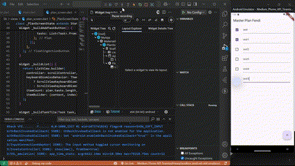

# Dokumentasi Praktikum Master Plan

## Penjelasan Praktikum

Praktikum ini bertujuan untuk membuat aplikasi perencanaan tugas menggunakan Flutter.
Aplikasi ini memungkinkan pengguna untuk menambahkan tugas, menandai tugas sebagai selesai, dan menggulir daftar tugas.

### **Langkah 4: Penjelasan**

Langkah 4 bertujuan untuk membuat struktur proyek agar lebih terorganisir dengan memisahkan tampilan (UI) dari logika data. Dengan menggunakan folder **models**, kita dapat mengelola struktur data secara terpisah dari tampilan UI.

### **Langkah 6: Mengapa Perlu Variabel `plan`?**

Variabel `plan` digunakan untuk menyimpan data perencanaan yang mencakup daftar tugas. Dibuat sebagai konstanta (`const Plan()`) untuk memastikan bahwa nilai awalnya tetap dan tidak dapat diubah langsung, sehingga setiap perubahan harus dilakukan dengan membuat objek baru.

### **Langkah 9: Hasil dan Penjelasan**

Langkah ini menambahkan tampilan **ListTile** untuk setiap tugas dalam daftar perencanaan. Berikut adalah GIF hasil implementasi:

Pada langkah ini, setiap tugas ditampilkan dalam bentuk **TextFormField** dan dapat ditandai dengan checkbox.

### **Kegunaan Method pada Langkah 11 dan 13 dalam Lifecycle State**

- **Langkah 11 (`initState`)**
  - Method ini digunakan untuk menginisialisasi `ScrollController`.
  - Menambahkan listener untuk menghapus fokus dari semua input teks ketika pengguna menggulir daftar.
- **Langkah 13 (`dispose`)**
  - Method ini digunakan untuk membersihkan `ScrollController` saat widget dihapus dari tree.
  - Mencegah kebocoran memori dengan memastikan controller tidak terus berjalan setelah widget tidak lagi digunakan.
